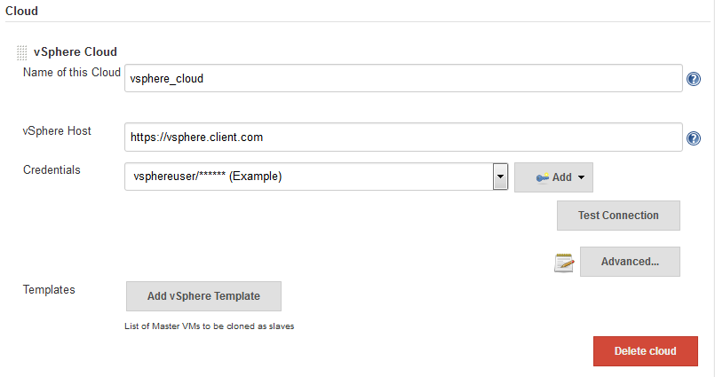
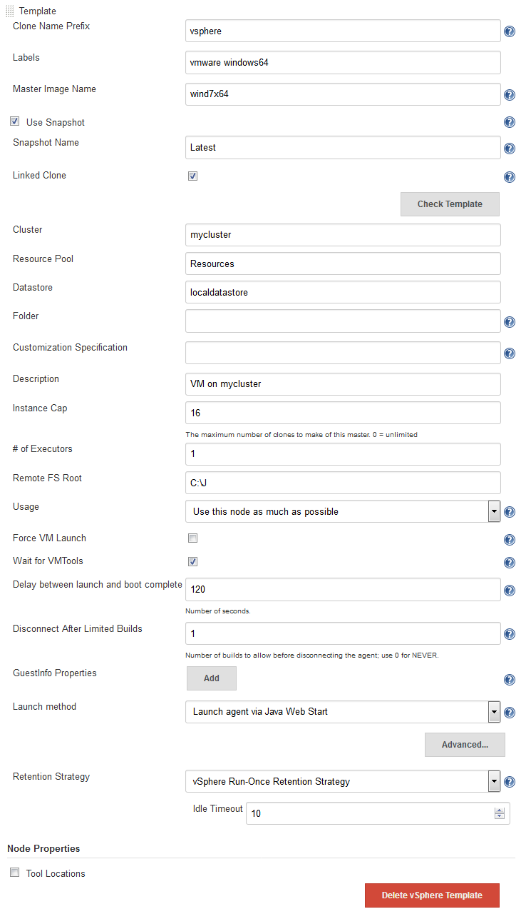
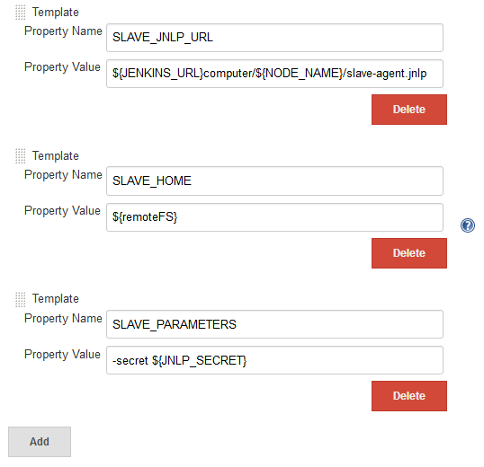
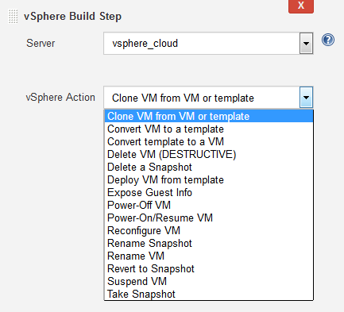

# Jenkins Configuration

This section describes how to control the functionality this plugin provides to Jenkins.

## vSphere Cloud Configuration

The first step is to configure Jenkins to know what vSphere server you will be using.
To do this you need to add a new "Cloud" in the Jenkins "Configure System" menu.

You will need to enter a display name for this vSphere cloud, the hostname of your vSphere server, and login credentials.
You can (in the Advanced... settings) also specify limits on the number of VMs to be created by Jenkins.

The "vSphere Host" is the name of the VMware vCenter service endpoint;
it usually has a format of
`https://host-name-or-IP-address`

The credentials specify the username and password used to log in to the vSphere Host.
If you do not have existing credentials defined for this within Jenkins then you will need to "Add" them and then refresh/reload this page.

The "Test Connection" button will test to see if your vSphere is accessible with the specified host name, user name and password.

The user entered when defining the cloud will need to have the following vsphere permissions:

|     |                                                                                                                                                      |
|-----|------------------------------------------------------------------------------------------------------------------------------------------------------|
| ■   | `Virtual machine.Provisioning.Clone virtual machine` on the virtual machine you are cloning.                                                   |
| ■   | `Virtual machine.Inventory.Create from existing` on the datacenter or virtual machine folder.                                                 |
| ■   | `Virtual machine.Configuration.Add new disk` on the datacenter or virtual machine folder.                                                      |
| ■   | `Resource.Assign virtual machine to resource pool` on the destination host, cluster, or resource pool.                                             |
| ■   | `Datastore.Allocate space` on the destination datastore or datastore folder.                                                                       |
| ■   | `Network.Assign network` on the network to which the virtual machine will be assigned.                                                             |
| ■   | `Virtual machine.Provisioning.Customize` on the virtual machine or virtual machine folder if you are customizing the guest operating system.   |
| ■   | `Virtual machine.Provisioning.Read customization specifications` on the root vCenter Server if you are customizing the guest operating system. |

## VM Clone Configuration

There are two ways to define the creation of a clone:

* Static configuration:
You can define the clone creation configuration globally.
It can later be referenced in the Jenkins job configuration by using a "label".
This configuration is done in the global Jenkins configuration.
  * This method is recommended for build jobs that "do not care about vSphere",
  e.g. basic compilation/test jobs which simply need a Jenkins node to run on.
* Per job configuration:
You can define the clone creation configuration individually in each job.
This configuration is done in the Jenkins job configuration.
  *This method is recommended for jobs which "know" that they are using vSphere to control a specific VM.

It is not uncommon to use both strategies,
e.g. per-job configuration to create VM templates for later use in the global configuration.

### Static configuration of clone creation

After adding a cloud you can configure Jenkins to create clones "on demand" by clicking on "Add vSphere Template" and then expanding the "Advanced..." section.
You may add as many templates that you wish.
Each template defines a means of creating a new VM to be used as a Jenkins node which will automatically be used to clone new nodes as necessary.
You can control which templates get used by specifying labels on the templates and "Restrict where build can run" on the jobs.

* Enter a "Clone Name Prefix",
that name will be used when creating new clones.
The new clone will be named: `<clone_prefix><UUID>`, where UUID is some dynamically created UUID added to the prefix.
Prefixes **MUST** be sufficiently unique that any given name can be uniquely matched to a single prefix.
* The "Master Image Name" is the name of the master image which will be used to make the new clones.
* Use snapshot: (optional)
If ticked, the new clone will be based on a Snapshot within the master image instead of the "live" image.
Ticking this enables the following:
  * Snapshot Name: The name of the snapshot to use, e.g. "Latest".
  * Linked Clone:
  A linked clone is where the disks of the clone are defined as a delta from the template's disks,
  meaning that storage space if only required on vSphere for the differences,
  rather than each clone requiring its own (full) copy of the template's disks.
  Recommended for short-lived VMs as otherwise it takes longer to clone the disks than it does for anything else.
* Enter Cluster, Resource Pool, Datastore, Folder, Customization Specification as required, this are settings how the clone will be created in vSphere.
Enter "Resources" as default for "Resource Pool" if you haven't explicitly defined resource pools in vCenter.
* Labels:
You can use these labels to configure a job where it should be built.
Use the label in the box "Restrict where this project can be run" in the job configuration.
This is how Jenkins decides which template to use.
* Force VM Launch:
Launches (in vSphere, not Jenkins) the virtual machine when necessary.
* Wait for VMTools:
Useful if the virtual machine has VMTools installed;
when enabled, Jenkins will wait until VMTools is running before continuing with the connection
allowing a lower "Delay between launch and boot complete" value without sacrificing reliability.
* Delay between launch and boot complete:
Number of seconds to delay after starting the virtual machine (or after waiting for VMTools) before assuming the node is operational.
* Disconnect after Limited Builds: Will force the node agent to disconnect after the specified number of builds have been performed, triggering the disconnect action.
**Note:** Currently, the "Disconnect After Limited Builds" configuration parameter is not used.
* GuestInfo Properties:
you can use "guestinfos" to provide properties (e.g. the URL to the Jenkins Master and the JNLP "secret") to the clone.
This is especially useful if you chose "Java Web Start" (JNLP) as launch method, e.g. for a Windows VM.
See below for further details and example.
* Retention Strategy:
Whether to use each VM once before disposing of it (the "Run-Once" strategy) or to allow the VM to run multiple builds and only be disposed of once the VM has remained unused for too long (the "Keep-Until-Idle" strategy).
If your builds require a fresh VM then use "Run-Once", otherwise the "Keep-Until-Idle" will be more efficient.

GuestInfo properties (mentioned above) allow you to pass information from Jenkins to the newly started VMs.
If you are using the SSH launch method then you may not need this, but if you are using Java Web Start (JNLP) then this will be needed to tell your agent.jar process where the Jenkins server is, what node it is, the JNLP "secret" etc.
For example, to pass the data necessary for the newly-started VM to start a JNLP agent.jar process and connect back to Jenkins, you could set the following GuestInfo properties:

You would then need to ensure that, after bootup,
your VM would automatically use the vmware tools to reach each of these properties
(e.g. `vmtoolsd --cmd "info-get guestinfo.SLAVE_JNLP_URL"` to request the jnlp URL)
before starting the agent.jar with those arguments.

All the rest of the configuration variables are the same as when you define a Static Node.
Please see below for information on setting those configuration parameters.

### Per job configuration of clone creation

Add a new "vSphere Build Step" in the job configuration and select the desired action.

#### Build Steps

Build steps can be used to interact directly with your vSphere instances.
Typical use cases have been added as build steps.
If you would like to see more functionality in this plugin,
please open an enhancement request ticket to discuss the idea before raising a pull request for its implementation.
Note that any such functionality is dependent on there being support for it in the vSphere API and in the yavijava library.

#### Clone VM from Template or VM

This build step will clone an existing Template or VM to a new VM.
Linked clones are optional.
Cluster, Resource Pool, and Datastore can be specified.

#### Deploy VM from Template

This build step will create a VM from the specified template.
The template must have at least one snapshot before it can be cloned.
A linked clone may optionally be chosen.
The new VM will be placed in the same folder and storage device as the original template, and will use the specified ResourcePool and Cluster.

#### Convert VM to Template

This build step will mark the specified VM as a template.
The VM must be powered down first, or the user must use the "force" option.

#### Convert Template to VM

This build step will convert a template into the VM. 

#### Delete VM

This build step will delete the specified VM.
At this time, templates will not be deleted by this build step.

As an additional precaution against accidental deletion, if the name or description associated with the vSphere Cloud changes after the Job has been saved, the job will need to be re-saved before it will function correctly.

**WARNING:** THIS IS A DESTRUCTIVE OPERATION THAT WILL DELETE THE VIRTUAL MACHINE WITHOUT ADDITIONAL CONFIRMATION.  IT CANNOT BE UNDONE.

#### Power-On / Resume VM

This build step will power on the specified VM and store the IP address in the "VSPHERE\_IP" environment variable.
The build step will wait as long as specified in the "timeout" field (max 3600 seconds).
This build step will resume suspended VMs as well.

#### Power-Off VM

This build step will power off the specified VM.
There is an optional "Graceful shutdown", to attempt a shutdown via VMware Tools, if it's installed.

#### Reconfigure VM

This build step will allow selectively reconfiguration of the VM.
The following reconfigurations are available:
* Edit CPU - change the number of cores and/or sockets.
* Edit Disk - add a new disk
* Edit RAM - change the amount of RAM
* Edit NIC - Add, edit or remove a NIC interface, specify label, MAC address and port group.
* Edit Notes - Add-to/replace the text "Notes" for the VM.

#### Rename Snapshot

This build step allows renaming of a snapshot.

#### Rename VM

This build step will allow renaming the VM

#### Suspend VM

This build step will suspend the specified VM. 

#### Revert to Snapshot

This build step will revert the specified VM to the specified snapshot.

#### Take Snapshot

This build step will take a snapshot of the specified VM using the specified Snapshot name, description, and whether or not to include memory in the snapshot. 

#### Delete a Snapshot

This build step will delete a specified snapshot from a specified VM.
It will optionally consolidate all of the VM's disks.

**WARNING:** THIS IS A DESTRUCTIVE OPERATION THAT WILL DELETE THE SNAPSHOT WITHOUT ADDITIONAL CONFIRMATION.  IT CANNOT BE UNDONE.

**Disclaimer:** This list is a guide only.
Additional capabilities are typically added by volunteers for whom functionality is usually a higher priority than documentation.
Further (and sometimes better) documentation can be found in the online help in the Jenkins UI.
